# 实战篇: iOS项目开发技能

<p align="center"><a href="https://github.com/ChenYilong/iOSInterviewQuestions/blob/master/02_Swift_interview_questions/theory.md"></a></p>

Swift面试题共分为两篇:

- [《理论篇: Swift/ObjC 语言基础》](https://github.com/ChenYilong/iOSInterviewQuestions/blob/master/02_Swift_interview_questions/theory.md) 
 - [《实战篇: iOS项目开发技能》]( https://github.com/ChenYilong/iOSInterviewQuestions/blob/master/02_Swift_interview_questions/practical.md ) 

是我自己在国外面试时准备的笔记, 所以很多是英文的, 后续有时间再翻译. 

# 目录

**SwiftUI** 

- Are you familiar with SwiftUI?
- What is Property Wrapper in SwiftUI? What’s the difference between @ObservedObject, @State, and @EnvironmentObject? 
- Can you explain the difference between a state object and an observed object in SwiftUI?

 **Combine、函数式与响应式编程：**

- Explain reactive programming and its advantages, mentioning frameworks like RxSwift and Combine. 如何在 Swift 中实现函数式编程？请举一个示例。
- Q.Swift 是面向对象还是函数式的编程语言?
- What's the difference between `passthroughSubject` and `CurrentValueSubject`?

**设计模式：**

- What's your ideal iOS project set up like?
- Can you explain how you would design a login page using the MVP/MVVM architecture?
- What is the singleton pattern, and what are some considerations when using it?
- What is the difference between MVVM (Model-View-ViewModel) and clean architecture?What is the difference between clean and MVVM architecture?
- What kind of code typically resides in view models in MVVM?
- Can you at a high level explain what are the different moving parts of MVP/MVVM architecture?
- Can you explain the technical details and the features you were responsible for covering off what architecture you used what, technical decisions you made? Could you touch up on any of the native iOS projects you worked on? What was the architecture you used in your projects?
- if you could add a high-level, based on any of your recent projects, the longest you've been associated with, can you just walk me through the features you were responsible for and just in terms of technical aspects, in terms of what architecture you used and things like that and then we can probably go on from there?

**并发和多线程开发：**

- How can you avoid data racing issues when using the singleton pattern in a multi-threaded environment?
- Can you give examples of different types of locks used in concurrent programming?
- Can you describe what async/await is?
- How can you wait for multiple network calls to complete before calling a function that relies on the results?
- 结构化并发（Structured Concurrency）：How to implement structured concurrency?


**网络编程：**

- How does the device register for push notifications, and how do notifications come from the server side?
- Can you explain how token-based authentication works, where you obtain a token from an API and use it for subsequent API calls?

**安全相关：**

- How do you securely store API keys in your Swift code without exposing them? Have you worked with making API calls that require API keys? How did you handle the secure storage of those keys?

**调试、版本管理、项目管理：**

- If your app has performance issues, how would you identify them and how do you resolve them?
- Are you familiar with setting up CI/CD pipelines for Swift projects?
- Can you tell me more about how you manage libraries and codebases in your project?
- How do you debug crash issues in your daily work?

**Unit Test**

1. How to mock data
1. How to separate production env and mock
2. How to test the view model with SwiftUI?
3. How to inject mocked networking logic?
4. What's Test-driven development?

 **UI布局**

- How do you create UI elements like labels and images, and how do you manage their layout and orientation when the device is rotated?
- Are you using any third-party libraries for layout in Auto Layout? .
- What is the Intrinsic Content Size in Auto Layout for?
- What is the purpose of prepareForReuse of the Cell of UITableView and when will it be called?


# 正文

## **SwiftUI** 

## Are you familiar with SwiftUI?


## What’s the difference between @ObservedObject, @State, and @EnvironmentObject?

https://www.hackingwithswift.com/quick-start/swiftui/whats-the-difference-between-observedobject-state-and-environmentobject

我写的有点老了，现在iOS17 是Observation框架，性能更好了，不过写法不同了. 等忙完这段时间, 我完善下. 先看下iOS17 以前的写法.

[Answer from AI](https://chat.openai.com/share/cd46dff5-9d7e-4990-8fe9-595e2aa65080)

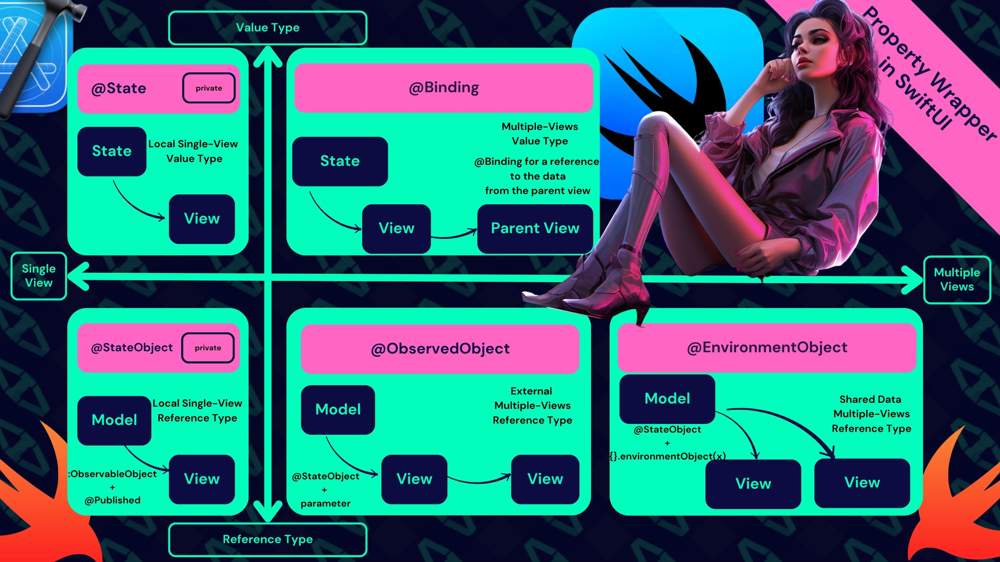


[swift @State @Published+@StateObject+@ObservedObject+@ObservableObject+@Binding+$0$1_swift @published有什么用_linzhiji的博客-CSDN博客](https://blog.csdn.net/linzhiji/article/details/128094116)

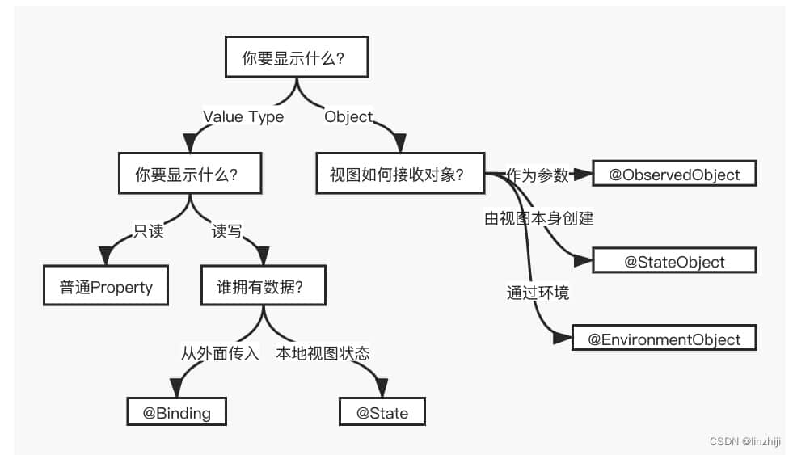


@ObservedObject, @State, and @EnvironmentObject?

@State == value type 

@StateObject (@ObservedObject) == ref type

@Binding two+ view value type 

@EnvironmentObject? == ref type 周期长

|  | Single View | Multiple Views |
| --- | --- | --- |
|  | Value Type | Reference Type |
|  |  |  |

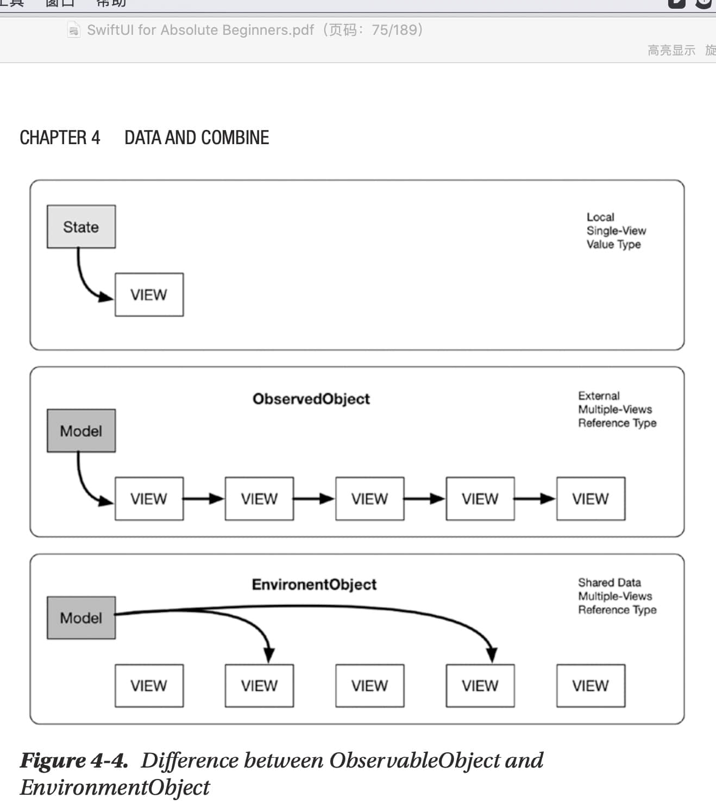


[MVVM in SwiftUI](https://swdevnotes.com/swift/2021/mvvm-in-swiftui/)

[@StateObject vs. @ObservedObject: The differences explained](https://www.avanderlee.com/swiftui/stateobject-observedobject-differences/)

[Understanding Data Flow in SwiftUI](https://www.kodeco.com/11781349-understanding-data-flow-in-swiftui)

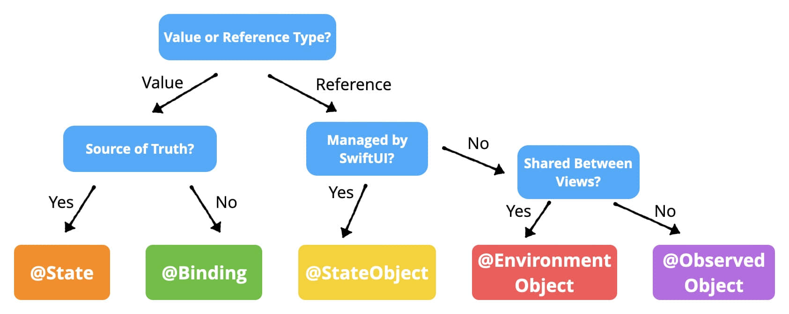


## **Combine、函数式与响应式编程：**


## Explain reactive programming and its advantages, mentioning frameworks like RxSwift and Combine.

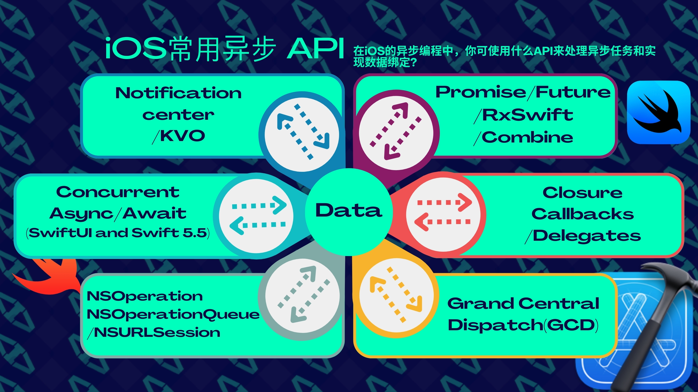
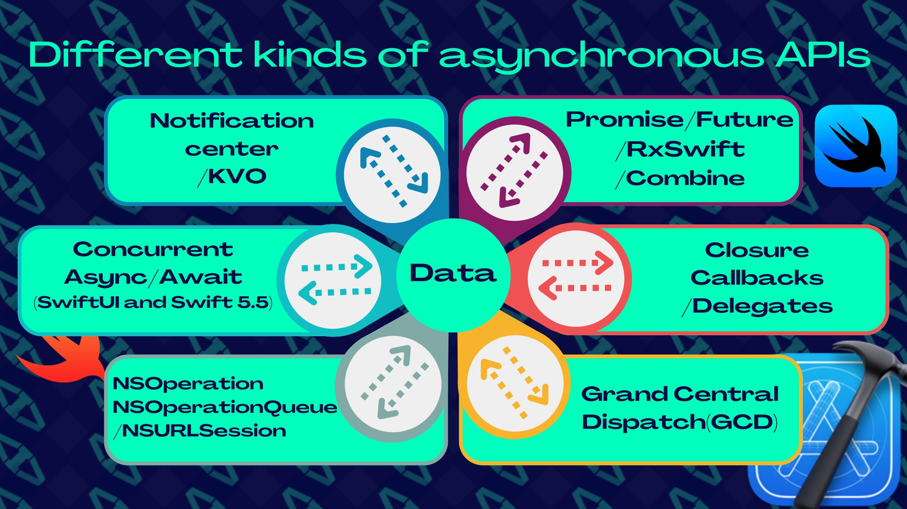

 [Answer from AI]( https://chat.openai.com/share/8e77bb97-fdf9-405a-bd44-9c769777211f "") 

Combine类似 RxSwift(一个类Redux的架构)

## Q.Swift 是面向对象还是函数式的编程语言?

A:

Swift 既是面向对象的，又是函数式的编程语言。
说 Swift 是面向对象的语言，是因为 Swift 支持类的封装、继承、和多态，从这点上来看与 Java 这类纯面向对象的语言几乎毫无差别。
说 Swift 是函数式编程语言，是因为 Swift 支持 map, reduce, filter, flatmap 这类去除中间状态、数学函数式的方法，更加强调运算结果而不是中间过程。

函数式的编程，通俗易懂的讲解

[一文读懂Swift函数式编程](https://zhuanlan.zhihu.com/p/192483039)

拓展问题: 如何在 Swift 中实现函数式编程？请举一个示例。

#### 5. What's the difference between `passthroughSubject` and `CurrentValueSubject`?

https://chat.openai.com/share/390f02bf-7c26-461d-908a-172e53d9177f


 [PassthroughSubject vs. CurrentValueSubject explained]( https://www.avanderlee.com/combine/passthroughsubject-currentvaluesubject-explained/ "") 


## **设计模式：**
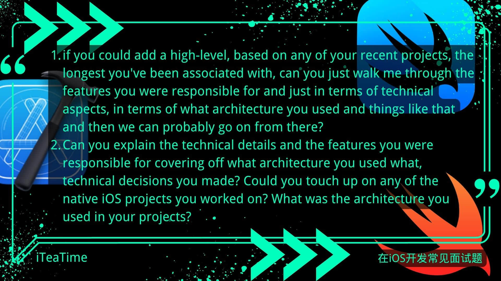

## MVC vs MVP vs MVVM

[Researching MVVM in Swift](https://www.agnosticdev.com/blog-entry/swift/researching-mvvm-swift)

## 17. What is the difference between MVVM (Model-View-ViewModel) and clean architecture?What is the difference between clean and MVVM architecture?

## Clean MVVM 框架

[https://github.com/kudoleh/iOS-Clean-Architecture-MVVM](https://github.com/kudoleh/iOS-Clean-Architecture-MVVM)

新西兰的各类流行框架

[g-enius - Repositories](https://github.com/g-enius?page=1&tab=repositories)

就是那个TCA？TCA在clean的基础上加了很多功能. 很多名称在TCA和clean上叫的不一样.

而且tca组件之间通讯有点复杂.

复杂页面的话. 冗余代码太多, 比如usercase和service

父子通讯真的麻烦, 还得用delegate.

一个clean的例子

[Clean Architecture: iOS App](https://paulallies.medium.com/clean-architecture-ios-app-100539550110)

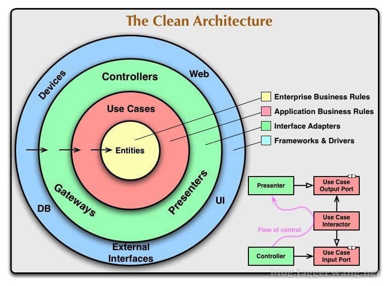


TDD friendly我觉得是个优点.TCA(TCA一般是指：the composable architecture)有点插件式的感觉，你要调用子component的逻辑，你就得把它的state、action、scope都声明一下就能用了.

感觉最大的优势，还是代码清晰。。。。

state，action本身内部内聚很高, 类似声明. 一旦类似delegate的action出去了. 单看一个模块就读不出完整逻辑了. 我觉得reducer做到了有所有的逻辑啊，delegate也只是一种effect而已.  跟其他的effect没有什么区别. 原来这个模块这条链路是这个意思.它问了Clean框架, 我说我听过, 没用过. 新西兰有很多移动端的架构就是Clean.

[Clean Architecture for SwiftUI](https://nalexn.github.io/clean-architecture-swiftui/)

clean喜欢把protocol化可注入的层叫use case，命名一般叫xxxRepository


## What kind of code typically resides in view models in MVVM?

非常好的 MVVM 的开源项目, 可以学习下: https://github.com/kickstarter/ios-oss

What is the difference between clean and MVVM architecture?

[MVVM with Combine Tutorial for iOS](https://www.kodeco.com/4161005-mvvm-with-combine-tutorial-for-ios)


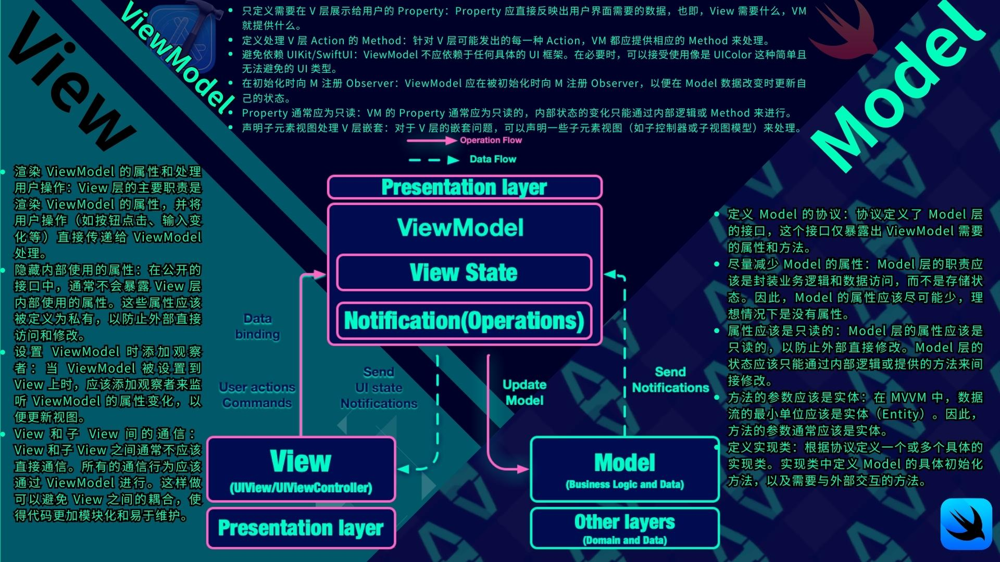


然后这是几个系统设计或者客户端设计相关的repo：
[https://github.com/donnemartin/system-design-primer](https://github.com/donnemartin/system-design-primer)

[https://github.com/weeeBox/mobile-system-design](https://github.com/weeeBox/mobile-system-design)

[https://github.com/skyming/Trip-to-iOS-Design-Patterns](https://github.com/skyming/Trip-to-iOS-Design-Patterns)

[https://github.com/kudoleh/iOS-Clean-Architecture-MVVM](https://github.com/kudoleh/iOS-Clean-Architecture-MVVM)

[https://github.com/kickstarter/ios-oss](https://github.com/kickstarter/ios-oss)

[https://chat.openai.com/share/30b798b8-96f2-45e2-a1e3-d02babd8d1c8](https://chat.openai.com/share/30b798b8-96f2-45e2-a1e3-d02babd8d1c8)

在MVVM（Model-View-ViewModel）架构中，ViewModel 是一个抽象，它代表了 View 需要用到的数据和命令。因此，ViewModel 通常会包含以下类型的代码：

1. **数据绑定**：ViewModel 包含了视图需要的所有数据，这些数据通常会通过数据绑定的方式在视图中显示。因此，ViewModel 通常会包含一些属性（property），这些属性被绑定到视图上，当属性的值改变时，视图会自动更新。
2. **命令**：ViewModel 还会包含一些命令（Command），这些命令对应了用户的操作（比如点击按钮）。命令通常会修改 ViewModel 中的数据，然后这些修改会通过数据绑定反映到视图上。
3. **数据访问和业务逻辑**：ViewModel 还可能包含一些业务逻辑，比如数据的读取和写入。这些业务逻辑可能会通过调用 Model 层的方法来实现。
4. **状态管理**：ViewModel 还可能包含一些状态管理的代码，比如正在加载的状态、错误状态等。

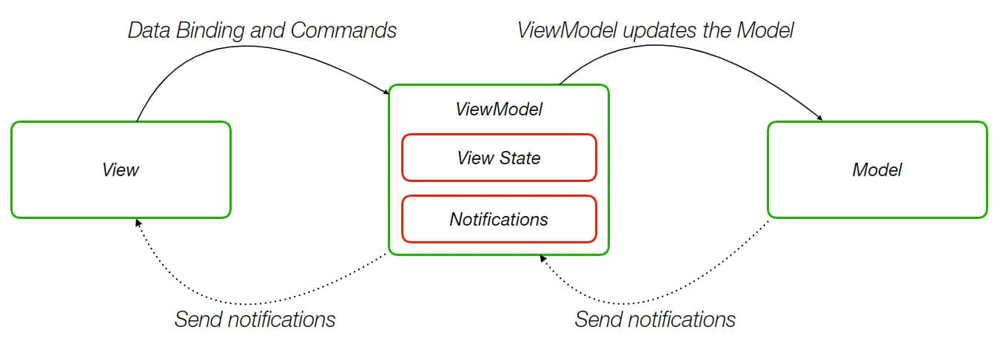


需要注意的是，ViewModel 不应该直接访问 View，所有的交互都应该通过数据绑定和命令来完成。这样可以确保 ViewModel 和 View 的解耦，使得 ViewModel 可以方便的进行单元测试。

```swift
//下面是一段 MVVM 中的 ViewModel 代码. 请指出下面的代码中, 分别对应着 ViewModel 的哪些职责?
// [2023-07-28 16:43:05] @iTeaTime(技术清谈)@ChenYilong
enum ViewState {
    case loading
    case loaded
    case error(string: String)
}

protocol ContentListViewModelProtocol {
    associatedtype Content
    associatedtype ContentCellViewModel: ContentCellViewModelProtocol where ContentCellViewModel.Content == Content
    var contents: Observable<[Content]> { get set }
    var contentCellViewModels: [ContentCellViewModel] { get set }
    var viewState: Observable<ViewState> { get }
    var searchText: Observable<String> { get }
    
    func contentCellViewModel(for content: Content) -> ContentCellViewModel
    func update() async throws
} 

import Foundation

final class PostListViewModel: ContentListViewModelProtocol {
    
    func contentCellViewModel(for post: Post) -> PostCellViewModel {
        let postCellViewModel = PostCellViewModel(content: post)
           return postCellViewModel
       }

    var contentCellViewModels: [PostCellViewModel] = Array()
    var contents = Observable<[Post]>(value: [])
    var allPosts: [Post] = []  // this would hold all your contents
    var viewState = Observable<ViewState>(value: .loading)
    var searchText = Observable<String>(value: "")
    
    private var repository: Repository
    
    init(repository: ApiRepository = ApiRepository()) {
        self.repository = repository
        setupSearchTextObserver()
    }
    
    func setupSearchTextObserver() {
        searchText.addObserver { [weak self] text in
            self?.filterContentForSearchText(text)
        }
    }
    
    func filterContentForSearchText(_ searchText: String) {
        guard !searchText.isEmpty else {
            self.resetFilters()
            return
        }
        
        let filteredPosts = allPosts.filter { (post: Post) -> Bool in
            return post.title.lowercased().contains(searchText.lowercased())
        }
        contents.value = filteredPosts
    }
    
    func resetFilters() {
        setupAllPosts()
    }
    
    func setupAllPosts() {
        contents.value = allPosts
    }
    
    func update() async throws {
        do {
            viewState.value = .loading
            let contents = try await repository.fetchPosts()
            if contents.isEmpty {
                self.viewState.value = .loading
            } else {
                self.viewState.value = .loaded
                self.allPosts = contents
                setupAllPosts()
            }
        } catch {
            // handle error
            self.viewState.value = .error(string: error.localizedDescription)
            throw error
        }
    }
    
    deinit {
        contents.removeObserver()
        viewState.removeObserver()
    }
}
```

在你给出的代码中，以下是如何对应到我前面说的四个方面：

1. **数据绑定**：在这个例子中，`contents`，`contentCellViewModels`，`viewState` 和 `searchText` 都是 `Observable` 类型，它们都被绑定到了视图上。当这些 `Observable` 对象的值改变时，视图会自动更新。
2. **命令**：`func contentCellViewModel(for content: Content) -> ContentCellViewModel` 和 `func update() async throws` 这两个方法就是命令，它们对应了用户的操作，比如点击按钮或者刷新页面。
3. **数据访问和业务逻辑**：在 `func update() async throws` 方法中，代码调用了 `repository.fetchPosts()` 方法从服务器获取数据，这部分就是数据访问。然后在获取数据后，代码根据获取的数据修改了 `contents` 和 `allPosts`，这部分就是业务逻辑。
4. **状态管理**：`viewState` 属性就是用来管理状态的。它的值可能是 `.loading`，`.loaded` 或者 `.error`，分别代表了不同的状态。在 `func update() async throws` 方法中，根据数据加载的结果，代码会修改 `viewState` 的值，从而反映出当前的状态。


### Architecture, Pattern, and System Design

#### 1. Pattern

**VIPER**
https://github.com/adib/ViperMovieDemo

https://github.com/unwire/viper-demo-ios

**MVVM**:

Clean MVVM: https://www.vadimbulavin.com/modern-mvvm-ios-app-architecture-with-combine-and-swiftui/

https://github.com/kudoleh/iOS-Clean-Architecture-MVVM

Modern MVVM: https://www.vadimbulavin.com/modern-mvvm-ios-app-architecture-with-combine-and-swiftui/

**Redux**:

Redux: https://www.raywenderlich.com/22096649-getting-a-redux-vibe-into-swiftui

#### 2. Describe binding in MVVM.

#### 3. Mobile System Design
https://github.com/donnemartin/system-design-primer

https://github.com/weeeBox/mobile-system-design

https://github.com/skyming/Trip-to-iOS-Design-Patterns

#### 4. What's the Clean Architecture?
https://indiespark.top/programming/how-implement-viper-clean-architecture-ios/

## Software Engineering
https://www.whizlabs.com/blog/agile-scrum-interview-questions/

https://www.interviewbit.com/agile-interview-questions/

#### 1. What's the difference between Greenfield and Brownfield?
https://synoptek.com/insights/it-blogs/greenfield-vs-brownfield-software-development/

#### 2. What do you think of refactoring?


**并发和多线程开发：**

## 11. How can you avoid data racing issues when using the singleton pattern in a multi-threaded environment?

是不是现在所有swift里的线程问题，都可以通过actor解决？我回答的, 是用GCD, 重写 getter和setter, 实现异步读取, 同步写入.只要保证setter和getter在一个队列里就行. setter是同步, getter同步和异步都行.

#### 9. How do let functions run in the main queue?
@MainActor, DispatchQueue.main, Runloop.main


## Can you give examples of different types of locks used in concurrent programming?


[https://chat.openai.com/share/6843abbf-37fe-46bc-94aa-fb8f9aea2d5b](https://chat.openai.com/share/6843abbf-37fe-46bc-94aa-fb8f9aea2d5b)

Concurrency in iOS and Swift development can present a number of challenges, one of which is ensuring that shared resources are accessed safely. To control access to these resources and prevent issues such as race conditions, different types of locks are used. Here are some examples:

1. **NSLock:** NSLock is one of the simplest locking mechanisms. It provides a basic lock and unlock functionality.

```swift
let lock = NSLock()

lock.lock()
// Critical section
lock.unlock()
```

2. **Recursive Lock (NSRecursiveLock):** Recursive locks are similar to NSLock, but they allow the same thread to acquire the lock multiple times without getting deadlocked.

```swift
let recursiveLock = NSRecursiveLock()

recursiveLock.lock()
// Critical section
recursiveLock.unlock()
```

3. **Condition Lock (NSConditionLock):** This type of lock allows for conditions to be used in conjunction with the locking mechanism, allowing threads to be locked or unlocked based on certain conditions.

```swift
let conditionLock = NSConditionLock(condition: 1)

conditionLock.lockWhenCondition(1)
// Critical section
conditionLock.unlockWithCondition(2)
```

4. **Read-Write Lock (pthread_rwlock_t):** This type of lock allows multiple reads without locking, but writes will lock. This is useful when you have a resource that is often read but rarely updated.

```swift
var rwLock = pthread_rwlock_t()
pthread_rwlock_init(&rwLock, nil)

pthread_rwlock_rdlock(&rwLock) // for read lock
// Read data
pthread_rwlock_unlock(&rwLock)

pthread_rwlock_wrlock(&rwLock) // for write lock
// Write data
pthread_rwlock_unlock(&rwLock)
```

5. **Semaphore (DispatchSemaphore):** Semaphores manage a finite pool of resources. A DispatchSemaphore is an efficient implementation of a traditional counting semaphore.

```swift
let semaphore = DispatchSemaphore(value: 1)

semaphore.wait() // decrementing the semaphore's count
// Critical section
semaphore.signal() // incrementing the semaphore's count
```

6. **Synchronized:** While not directly a locking mechanism, the @synchronized directive in Objective-C provides a simple way to lock a section of code for a specific object, and Swift can take advantage of it using Objective-C runtime. However, it's not commonly used due to its performance overhead.

7. **Atomic Operations:** Swift 5 introduced the ability to perform atomic operations, which can often be used to replace locks in certain situations. It provides the way to safely mutate shared state from multiple threads by providing a series of atomic load, store, and compare-and-exchange operations.

8. **GCD (Grand Central Dispatch) Barriers:** While not technically a lock, dispatch barriers provide a mechanism to ensure that a certain block of code does not execute concurrently with other specified blocks of code. They're used with concurrent queues to create a serial-like section within the concurrent environment.

Each of these mechanisms has its own advantages and disadvantages. The choice of which one to use will depend on the specifics of the problem you're trying to solve. It's important to note that these locking mechanisms can often lead to other concurrency problems like deadlocks, so they should be used wisely.


#### 10. Can you describe what async/await is?
https://www.avanderlee.com/swift/async-await/

## 19. How can you wait for multiple network calls to complete before calling a function that relies on the results?
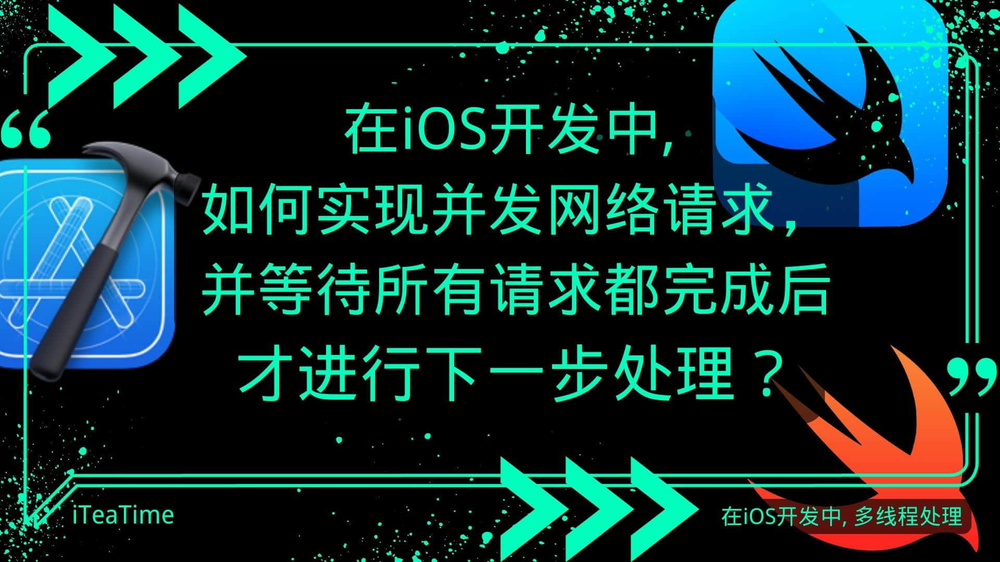

这个题就是给Task.group量身定制的么. 过去可能得用Semaphore吧.

it depends, if we do the network request in swift concurrency. I would use TaskGroup.

otherwise, use simple dispatch_group_t

[https://chat.openai.com/share/79258fec-cf51-41b4-adaf-64a7f91627b4](https://chat.openai.com/share/79258fec-cf51-41b4-adaf-64a7f91627b4)

在 Swift 5.5 及以后的版本，可以使用 `async/await` 以及 `TaskGroup` 来实现你所说的多个请求同时发出，然后等待所有的结果都回来。以下是一个基本的示例：
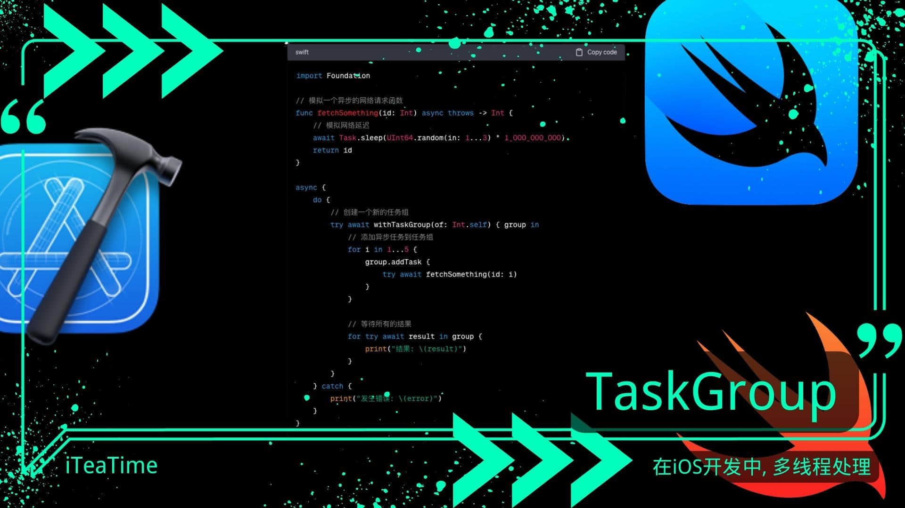

```swift
import Foundation

// 模拟一个异步的网络请求函数
func fetchSomething(id: Int) async throws -> Int {
    // 模拟网络延迟
    await Task.sleep(UInt64.random(in: 1...3) * 1_000_000_000)
    return id
}

async {
    do {
        // 创建一个新的任务组
        try await withTaskGroup(of: Int.self) { group in
            // 添加异步任务到任务组
            for i in 1...5 {
                group.addTask {
                    try await fetchSomething(id: i)
                }
            }

            // 等待所有的结果
            for try await result in group {
                print("结果: \\(result)")
            }
        }
    } catch {
        print("发生错误: \\(error)")
    }
}

```

在这个示例中，`fetchSomething(id:)` 是一个模拟的异步网络请求函数。它接受一个 `id` 参数，然后在一段随机的时间后返回这个 `id`。

然后，我们创建一个 `TaskGroup`，并向这个任务组添加5个异步任务。每个任务都会调用 `fetchSomething(id:)`，并传入不同的 `id`。

然后，我们使用 `for try await result in group` 这个循环等待所有的结果。当所有的结果都返回时，这个循环才会结束。

注意，这个代码应该在某个 `async` 函数或者闭包中运行。在这个示例中，我们使用 `async {}` 创建了一个异步闭包来运行这段代码。如果你在你自己的代码中使用这个模式，你应该把这段代码放在一个 `async` 函数中。

最后，请注意处理可能会抛出的错误。在这个示例中，我们使用 `do-catch` 来捕获并打印可能会发生的错误。

在 Swift 中，如果你不使用 async/await，你可以使用 `DispatchGroup` 来管理多个并发的任务。以下是一个基本的示例：

```swift
import Foundation

// 模拟一个异步的网络请求函数
func fetchSomething(id: Int, completion: @escaping (Int) -> Void) {
    DispatchQueue.global().asyncAfter(deadline: .now() + .seconds(Int.random(in: 1...3))) {
        completion(id)
    }
}

// 创建一个新的调度组
let group = DispatchGroup()

for i in 1...5 {
    group.enter()  // 在启动新任务前调用

    fetchSomething(id: i) { result in
        print("结果: \(result)")
        group.leave()  // 在任务完成后调用
    }
}

// 等待所有的结果
group.notify(queue: .main) {
    print("所有结果都已回来")
}
```

在这个示例中，`fetchSomething(id:completion:)` 是一个模拟的异步网络请求函数。它接受一个 `id` 参数和一个完成回调，然后在一段随机的时间后调用这个回调并传入这个 `id`。

然后，我们创建一个 `DispatchGroup`，并向这个调度组添加5个异步任务。每个任务都会调用 `fetchSomething(id:completion:)`，并传入不同的 `id` 和一个完成回调。

在启动每个任务之前，我们调用 `group.enter()`。在每个任务完成后，我们在完成回调中调用 `group.leave()`。

最后，我们使用 `group.notify(queue:)` 来等待所有的结果。当所有的结果都返回时，这个回调会被调用。

如果你不使用 `DispatchGroup` 和 `async/await`，你可以使用 `OperationQueue` 和 `Operation`。你可以将每个网络请求封装为一个 `Operation`，并将这些 `Operation` 添加到一个 `OperationQueue` 中。然后，你可以创建一个完成操作，设置其依赖为所有的网络请求操作，以此来实现等待所有结果都返回的功能。
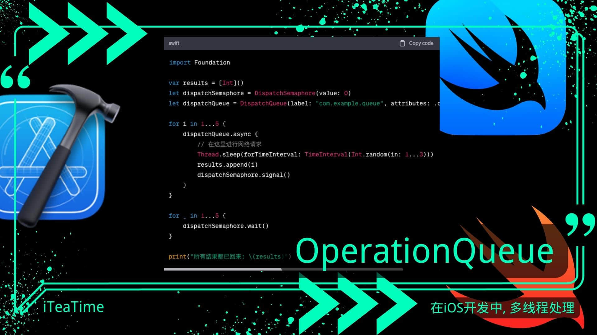

以下是一个基本的示例：

```swift
import Foundation

// 模拟一个异步的网络请求操作
class FetchOperation: Operation {
    let id: Int
    var result: Int?

    init(id: Int) {
        self.id = id
    }

    override func main() {
        // 在这里进行网络请求
        Thread.sleep(forTimeInterval: TimeInterval(Int.random(in: 1...3)))
        result = id
    }
}

// 创建一个操作队列
let queue = OperationQueue()

// 创建网络请求操作
var operations = [FetchOperation]()
for i in 1...5 {
    let operation = FetchOperation(id: i)
    operations.append(operation)
    queue.addOperation(operation)
}

// 创建一个完成操作
let completionOperation = BlockOperation {
    for operation in operations {
        print("结果: \(operation.result ?? 0)")
    }
}

// 设置完成操作的依赖
for operation in operations {
    completionOperation.addDependency(operation)
}

// 添加完成操作到队列
queue.addOperation(completionOperation)
```

在这个示例中，`FetchOperation` 是一个自定义的 `Operation`，用于模拟网络请求。它有一个 `id` 属性来标识每个请求，以及一个 `result` 属性来存储每个请求的结果。

然后，我们创建一个 `OperationQueue`，并向这个队列添加5个 `FetchOperation`。每个 `FetchOperation` 都会进行一个网络请求，并将结果存储在其 `result` 属性中。

接着，我们创建一个 `BlockOperation` 来作为完成操作。这个完成操作会等待所有的网络请求操作都完成，然后打印所有的结果。

为了实现这个功能，我们将所有的网络请求操作添加为这个完成操作的依赖。这样，只有当所有的网络请求操作都完成后，这个完成操作才会开始执行。

最后，我们将这个完成操作添加到队列中。

如果你不使用 `DispatchGroup`，`async/await`，和 `OperationQueue`，可以使用 `Semaphores` 一起配合 `DispatchQueue` 来实现等待所有结果返回。以下是一个基本的示例：

```swift
import Foundation

var results = [Int]()
let dispatchSemaphore = DispatchSemaphore(value: 0)
let dispatchQueue = DispatchQueue(label: "com.example.queue", attributes: .concurrent)

for i in 1...5 {
    dispatchQueue.async {
        // 在这里进行网络请求
        Thread.sleep(forTimeInterval: TimeInterval(Int.random(in: 1...3)))
        results.append(i)
        dispatchSemaphore.signal()
    }
}

for _ in 1...5 {
    dispatchSemaphore.wait()
}

print("所有结果都已回来: \(results)")
```

在这个示例中，首先创建一个并行队列 `dispatchQueue` 和一个信号量 `dispatchSemaphore`。信号量的初始值为0，表示没有可以使用的资源。

对于每个网络请求，我们都在 `dispatchQueue` 中创建一个新的任务。每个任务都会进行一个网络请求，并将结果添加到 `results` 数组中。当任务完成时，我们调用 `dispatchSemaphore.signal()` 来增加信号量的值，表示一个资源变为可用。

然后，我们使用一个循环来等待所有的结果。在每次迭代中，我们都调用 `dispatchSemaphore.wait()` 来减少信号量的值，表示我们正在等待一个资源。当所有的资源都变为可用时（也就是所有的网络请求都完成时），这个循环就会结束。

最后，我们打印所有的结果。


Grand Central Dispatch (GCD) 的 `barrier` 可以被用来实现在特定的并行队列中创建一个临界区，这个临界区在所有的先前的任务都完成之后才开始执行，并且它完成之前不会开始执行任何后续的任务。你可以用 `barrier` 来确保所有的网络请求都完成后再执行依赖于这些请求结果的操作。

下面是一个基本的示例：

```swift
import Foundation

let concurrentQueue = DispatchQueue(label: "com.example.queue", attributes: .concurrent)
var results = [Int]()

for i in 1...5 {
    concurrentQueue.async {
        // 在这里进行网络请求
        Thread.sleep(forTimeInterval: TimeInterval(Int.random(in: 1...3)))
        results.append(i)
    }
}

concurrentQueue.async(flags: .barrier) {
    print("所有结果都已回来: \(results)")
}
```

在这个示例中，首先创建一个并行队列 `concurrentQueue`。对于每个网络请求，我们都在 `concurrentQueue` 中创建一个新的任务。每个任务都会进行一个网络请求，并将结果添加到 `results` 数组中。

然后，我们使用 `concurrentQueue.async(flags: .barrier) {}` 来创建一个 `barrier` 任务。这个任务会等待所有先前的网络请求任务都完成后才开始执行，而且它完成之前不会开始执行任何后续的任务。在这个任务中，我们打印所有的结果。

注意：这个方法仅仅在自己创建的并行队列中有效，对于系统的全局并行队列并不起作用，因为全局并行队列不能被单个任务阻塞。


#### 1. How to implement structured concurrency?
https://www.hackingwithswift.com/swift/5.5/structured-concurrency


结构化并发（Structured Concurrency）：

Structured concurrency is a programming paradigm that aims to make concurrent execution more robust and manageable. In Swift, it was introduced with Swift 5.5 and provides a way to work with asynchronous code that simplifies error handling and resource management.

Here's a brief overview of how structured concurrency works in Swift:

1. **Task Management**: Structured concurrency in Swift lets you create and manage concurrent tasks within a specific scope, ensuring that the tasks are properly canceled or completed before moving on. This helps to avoid resource leaks and unexpected behaviors.

2. **Async/Await Pattern**: Using the `async` and `await` keywords, you can write code that appears synchronous, but can execute concurrently. This makes the code more readable and understandable, as it removes the need for callback closures, which can lead to "callback hell."

3. **Child Tasks**: You can create child tasks within a parent task, and they will be automatically managed within the context of that parent. This provides a clear hierarchy and ownership of tasks, which aids in proper resource management and error handling.

4. **Actors**: Swift’s structured concurrency also introduces actors, which are reference types that protect access to their mutable state. An actor class ensures that only one task is accessing its mutable state at any given time, helping to prevent data races.

5. **Cancellation**: Tasks can be easily canceled within their structured context, which ensures that all resources are properly cleaned up.

6. **Error Propagation**: Errors from child tasks can be easily propagated to parent tasks, making it simple to handle errors across different levels of the task hierarchy.

Here's an example of using async/await in Swift:

```swift
func fetchData() async throws -> Data {
    // ...
}

async {
    do {
        let data = try await fetchData()
        // Process data
    } catch {
        // Handle error
    }
}
```

Structured concurrency in Swift provides a safer and more intuitive way to write concurrent code, reducing common pitfalls associated with traditional concurrent programming practices.


## 网络编程

## 16. How does the device register for push notifications, and how do notifications come from the server side?

[https://chat.openai.com/share/0dc5e81b-cbf8-4c9a-99db-7df06b80f6c2](https://chat.openai.com/share/0dc5e81b-cbf8-4c9a-99db-7df06b80f6c2)

When registering for push notifications in iOS, there are a few steps involved:

1. The first step is to ask the user's permission. You can use the UserNotifications framework to request authorization to interact with the user when local and remote notifications arrive.

```swift
let center = UNUserNotificationCenter.current()
center.requestAuthorization(options: [.alert, .sound, .badge]) { granted, error in
    // Handle the result
}

```

1. If permission is granted, you then register your app’s notification types with the system. You accomplish this by calling the registerForRemoteNotifications() method of the UIApplication object.

```swift
UIApplication.shared.registerForRemoteNotifications()

```

1. In response to the registration request, the system prompts the user to allow or deny the request, and it gives the user the ability to change the decision later in system settings.
2. If the registration succeeds, the system calls your app delegate’s application(_:didRegisterForRemoteNotificationsWithDeviceToken:) method. In this method, the device token is given which you need to send to your server.

```swift
func application(_ application: UIApplication, didRegisterForRemoteNotificationsWithDeviceToken deviceToken: Data) {
    // Forward the token to your server
}

```

On the server side, a push notification is sent via Apple Push Notification service (APNs) or using the HTTP/2-based APNs provider API.

The general process is as follows:

1. Your server sends a request to APNs with the device token for the user's device and the payload for the push notification. The payload includes the notification's message text, launch image, and custom sound, among other user-facing details.
2. APNs forwards the notification payload to the user's device.

In terms of libraries, many companies use Firebase Cloud Messaging (FCM) or other third-party services such as OneSignal for handling notifications. They make it easier to manage the process of sending notifications, and they provide additional features such as analytics.

When using such services, you generally need to send the device token to your own server or to these third-party servers. They then use this token to send notifications to the device. The device token is like the address that the push notification server uses to deliver the push notification to the correct device.

## 24. Can you explain how token-based authentication works, where you obtain a token from an API and use it for subsequent API calls?


英文 | 中文
:-------------:|:-------------:
obtain | = have = 获得. 
subsequent | = following = 随后的. 

iOS 面试问题： 你能解释一下基于令牌的身份验证是如何工作的吗？如何在这种身份验证中，从应用程序接口获取一个令牌，并在随后的应用程序接口调用中使用它?

[Answer from AI](https://chat.openai.com/share/cd8cfa69-ab4c-4cf3-b45d-45884b52a72c)

令牌基础认证是一种用于验证用户身份并授权他们访问系统或应用的安全技术。以下是其基本运作过程：

1. **用户登录**:用户向服务器提交其凭证（通常是用户名和密码）。

2. **令牌生成**:如果凭证有效，服务器将创建一个令牌。这个令牌可以是一个简单的随机字符串，一个JSON Web Token（JWT），或者其他形式的令牌，这取决于系统设计。通常，令牌包含或与用户信息相关，可能包含他们在系统中的权限或角色。

3. **令牌传送**:服务器将生成的令牌发送回客户端。

4. **客户端存储**:客户端应用在本地存储令牌，例如在web应用的本地存储、会话存储或一个cookie中，或在移动应用的一个安全存储区域。

5. **令牌附加到后续请求**:客户端应用在每个后续的API请求中都包含令牌。这通常在HTTP头部完成 - 通常是在'Bearer {token}'格式的Authorization头部，但这取决于API的具体情况。

6. **服务器验证**:服务器验证附加在API请求上的令牌。如果它是有效的（并且没有过期），请求就会被处理。如果不是，将返回一个错误，通常是401 Unauthorized（未授权）HTTP状态。

7. **过期和刷新**:令牌具有有限的生命周期，并会在一段时间后过期。这是一个安全功能，用来限制令牌被盗的损害。当令牌过期时，服务器将拒绝请求，客户端应用将需要获取新的令牌。这可以通过重新验证用户或使用"刷新令牌"来完成，刷新令牌是一种生命周期更长的令牌，可以用来换取新的访问令牌。

这个系统使服务器避免存储会话状态数据 - 代替的是，所有必要的东西都打包到令牌中，从而形成一个无状态的，可扩展的系统。同时，它提供了一个健壮和安全的用户认证方法。


**安全相关：**

## 22 .How do you securely store API keys in your Swift code without exposing them? Have you worked with making API calls that require API keys? How did you handle the secure storage of those keys?

英文| 中文
:-------------:|:-------------:
expose | 暴露
secure storage | 安全存放问题

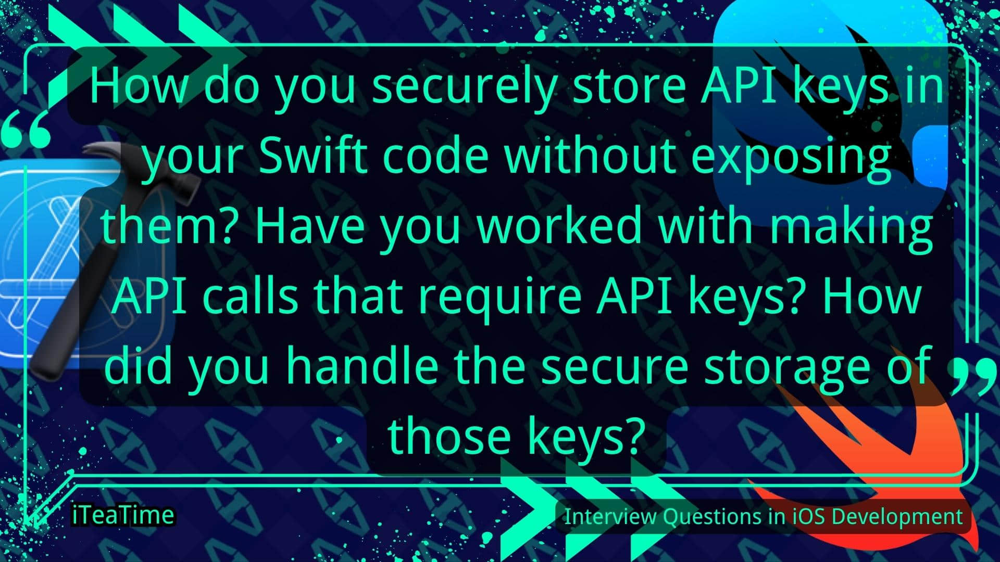
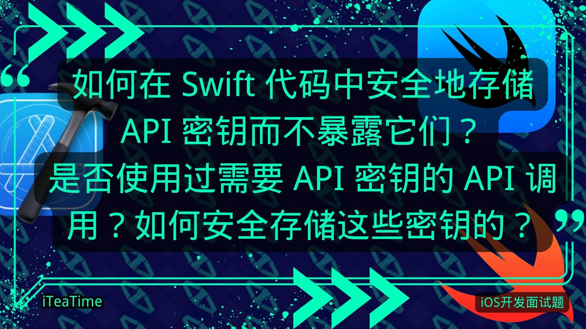


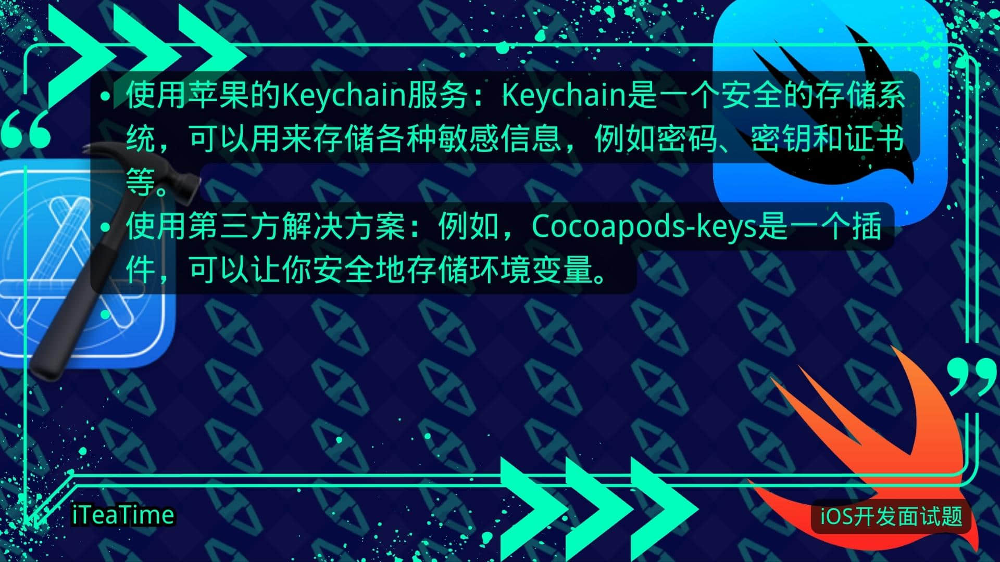


[Secure Secrets in iOS app](https://medium.com/swift-india/secure-secrets-in-ios-app-9f66085800b4)

在Swift代码中安全存储API密钥的方法有几种：

- 使用环境变量：你可以在编译时设置环境变量来存储API密钥。这种方法的优点是，即使源代码被公开，只有可以访问编译环境的人才能看到密钥。
- 使用`.xcconfig`文件：可以将API密钥存储在`.xcconfig`文件中，并在项目设置中引用该文件。然后在代码中使用`Bundle.main.infoDictionary?["API_KEY"]`来访问API密钥。为了安全，`.xcconfig`文件不应该被包含在版本控制系统中。
- 使用苹果的Keychain服务：Keychain是一个安全的存储系统，可以用来存储各种敏感信息，例如密码、密钥和证书等。
- 使用第三方解决方案：例如，Cocoapods-keys是一个插件，可以让你安全地存储环境变量。

[Secret Management on iOS](https://nshipster.com/secrets/)

是的，我在工作中使用过需要API密钥的API调用。我通常使用以上提到的几种方法来安全地存储这些密钥。实际选择哪种方法取决于具体的项目需求和团队协议。

当然，以下是一些关于如何改进在Swift中安全存储API密钥的建议：

1. 使用环境变量：确保您的构建环境安全性，例如，使用有足够权限的用户帐户来运行构建，并限制对构建服务器的访问。
2. 使用.xcconfig文件：在保存这种类型的文件时，您可以将它们加密，以便即使它们被复制或泄露，也无法直接访问。您还可以使用CI/CD工具，例如Jenkins或Gitlab CI，在构建时生成这些文件，并在构建完成后立即删除它们。
3. 使用苹果的Keychain服务：您可以使用高级的加密算法（例如AES）对保存在Keychain中的数据进行加密，以防止被静态分析。
4. 使用第三方解决方案：在选择第三方库时，应充分调查其安全性，并确保它们已通过适当的安全审查。您还应该定期更新这些库，以获取任何可能的安全更新。
5. 零知识证明：这是一种先进的密码学技术，可以使服务器验证用户的身份，而无需知道用户的凭证。这种方法可以用来替代传统的API密钥，进一步提高应用的安全性。
6. 在客户端不存储密钥：最好的方法可能是不在客户端存储密钥，而是在服务器端进行存储，并通过安全的方法在需要的时候将其传输到客户端。例如，每次需要API密钥时，都可以向一个安全的服务器端点发送请求，然后服务器会返回一个临时密钥，这个密钥在一段时间后会过期。这种方法的优点是密钥不会被永久存储在客户端，从而减少了被攻击者获取的可能性。


上面是标准的答案, 下面谈一下之前在项目中的一些实际操作: 

这个我们是做了十六进制的混淆的，每次调用在runtime里decode一下

'll do some letters replacement trick.like I'll replace all a to A, then save it to the disk.like key chains.这种, 简单的反汇编看到的string不是最终的key.

这个之前看到有些是放到单独的类，然后好像是把这个类从 Git 里移除.

凯撒密码。。。。机械加密法是最原始的加密方式.还不如hash呢. 不, 前提是这个key是字符串本地的 . 不是remote下载的. 

那就混合加密吧, 机械加密+DSA, 然后hash, 万无一失,

比如现在告诉你, apple key id 是 "abcde" 让你存本地, 你会怎么存, 打包就会带上的, 转成ASCII，然后当string用.转成ascii的话. 如果我是想偷key的人, 我就会用反编译工具简单查看所有string.找到这个之后. 打眼一看就是ascii的. 无任何安全措施. 

it depends,一方面是代码里面可以加密解密. 增加反编译的难度. 另一方面, 可以讲这些key存放在本地的一个文件中, 例如你可以把信息放进一个image中, 通过读取image, 再转换成string. 因为没人会知道一张图片是一个存放key的地方, 就算知道了, 也不知道key存在image哪里.让我想起了当年贴吧上的种图. 把片子的种子文件放在一个.rar文件里，然后跟一个image合并，上传贴吧 阿里的组件, 接入流程里, 会告诉你需要安全图片, 实际上就是存放 Key的地方. [https://baichuan.taobao.com/docs/doc.htm?spm=a3c0d.7662649.0.0.5608be48IxwIEA&treeId=129&articleId=118101&docType=1](https://baichuan.taobao.com/docs/doc.htm?spm=a3c0d.7662649.0.0.5608be48IxwIEA&treeId=129&articleId=118101&docType=1) 

因为key高概率都是字母数字符号啥的. 基本都在0x7F内.  传统加密会遇到一些问题.你以为要加密, 所以要提供另一个key, 会引入新的安全问题. 但是当然key多了, 估计偷的人也傻逼了.hash一下呢. hash不可逆哦. 我们密码学课上老师讲过，没有破解不了的加密方式，但是你可以让破解成本趋近于无穷. hash之后, 偷的人不知道了, app自己也不知道了. base64也算一种hash. base64结构太典型, 一眼就能看出. 直接decode. 理论上md5都是可逆的。。。。

这个我们就是用的keystore而已，外加一个过期时间.这个策略也跟后台他们对token的验证策略有关. 

keystore的问题在于是明文存储.所以需要加密之后塞进去才安全.DSA一下呗.不过密钥怎么存.你这样会引入新的安全问题.当然, 只要你引入的多了. 一堆key 属于是狡兔三窟. 偷的人估计放弃了. 过去一直播的数据加密，也是RSA+DES. 所以我选择使用传替换逻辑. 数据非对称加密，再把密钥对称加密. 简单的话. 替换逻辑最快.偷的人需要知道string 以及变更逻辑.这个都不需要AI就能分析出来。。。。这个变更逻辑就是加密算法 (只不过这个加密算法不需要其他key, 只是替换. 模仿游戏看过么.凯撒密码？图灵那个年代都能给你解出来.

[Secret Management on iOS](https://nshipster.com/secrets/)

举个例子嘛, 就是需要一个不需要其他key的加密算法. 需要一本莫名其妙的小说，当密码母本是吧.你之前说的base64, 简单ascii, 破解起来太轻松了.我们能做的就是提高他们的破解门槛.他那台机子可不是一般人能有的.机械密码发展到最后也就是英格玛密码机了，40年代的算力都能破解. 他能破解我, 但是懒得破解我, 所以我是安全的.


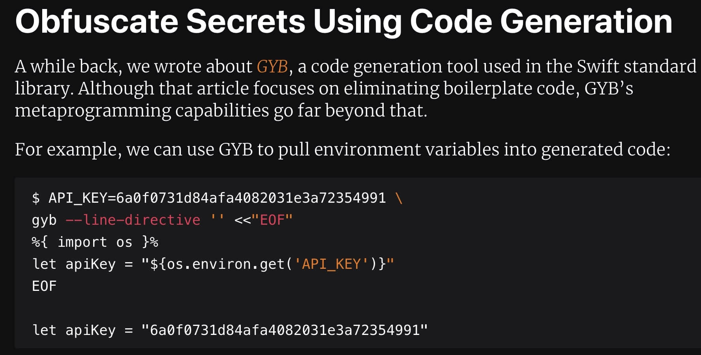


加点盐就够了.这是纯本地的嘛.appkey一般都是纯本地加密吧.你说的是oauth那套么.能放server不放client.如果只是判断用户身份的话. appkey没有啥好保密的. appsecret是关键, 是加密key.保护appsecret的方法就是上面咱们一直讨论的东西.app launch的时候就需要appkey呢？.放server的话，来不及啊.比如推送的key.看需求, 你说的是三方的appsecret是吧.我们之前用的推送库，既有appkey，也有appsecret.不可能放server啊，因为launch的时候，就需要验证这俩了.他们应该只需要传appkey吧.我看分享的那些只要appkey.不是，两个都得传.一个很奇怪的platform.以前用firebase，就只需要传一个.哦哦, 微博就是两个都穿.那确实奇怪. 为啥要穿这个. 可能微博用的不是理论上的appsecret ?现在呢. 我们换推送平台了.就变2个了

调试、版本管理、**项目管理：**

## 13. How do you debug crash issues in your daily work in iOS development?

[https://chat.openai.com/share/2bb17014-7b44-4310-bcb8-82e6344b2dde](https://chat.openai.com/share/2bb17014-7b44-4310-bcb8-82e6344b2dde)

关于Xcode新版本的查看 View Memory的步骤如下: To view memory in Xcode, go to Debug → Debug Workflow → View Memory.

我主要看的是这一篇
Advanced Swift debugging for UIKit
[https://medium.com/superhuman-co/advanced-swift-debugging-for-uikit-e154d1c28aaf](https://medium.com/superhuman-co/advanced-swift-debugging-for-uikit-e154d1c28aaf)

Debugging crash issues in iOS development can be done using several different tools and methods, including the following:

1. **Xcode Debugger**: This is the most commonly used tool for debugging iOS apps. The Xcode debugger allows developers to step through their code line by line, examine the state of variables and data structures, set breakpoints, and execute code snippets in real time.
2. **Crash Reports**: In the case of crashes, Xcode generates crash logs that can be extremely helpful in understanding what happened. You can access these logs in the "Window" menu under "Devices and Simulators". The logs will contain information about the state of the app and the device at the time of the crash.
3. **Exception Breakpoint**: By setting an exception breakpoint in Xcode, you can make the debugger stop whenever a certain type of exception is thrown. This can be particularly helpful for identifying the exact point at which a crash occurs.
4. **LLDB Console**: The LLDB console in Xcode is a powerful tool for debugging. It allows developers to evaluate and interact with their code on a very granular level.
5. **Instruments**: Apple's Instruments tool is extremely powerful for profiling and debugging memory leaks, performance issues, and other problems that can lead to crashes.
6. **Symbolicating Crash Logs**: Symbolicating crash logs helps transform memory addresses into human-readable function names and line numbers. This makes it easier to identify where a crash occurred in your code.
7. **Address Sanitizer and Undefined Behavior Sanitizer**: These are powerful tools available in Xcode for finding and fixing bugs related to memory corruption and undefined behavior.
8. **Third-party crash reporting tools**: Tools such as Crashlytics or Sentry provide real-time crash reporting, with detailed reports of the stack trace, device type, OS version, and other pertinent information.
9. **Unit Testing and UI Testing**: Building a robust suite of unit and UI tests can help catch issues before they make it into production.

In general, the approach to debugging will depend on the nature of the issue. If the issue is reproducible, you can use the debugger to step through the code and find where the problem is. If the issue is not easily reproducible, you might rely more on crash logs and other diagnostic information.


## Are you familiar with setting up CI/CD pipelines for Swift projects?

[https://chat.openai.com/share/8afd4553-c94f-4cf2-b90f-1ff22f7fc6b8](https://chat.openai.com/share/8afd4553-c94f-4cf2-b90f-1ff22f7fc6b8)

#### 使用 YAML 在 Microsoft Azure 

使用 YAML 在 Microsoft Azure 上为 Swift 项目创建 CI/CD 的过程大致分为以下步骤：

1. 首先需要在 Azure DevOps 里创建一个新的项目，然后将你的代码源通过 Git 上传到这个新的项目中。
2. 创建一个新的 Pipeline。在 Azure DevOps 的左侧菜单中选择 Pipelines，然后选择 New pipeline。
3. 选择源代码仓库类型。在这里，你需要选择你的代码存放的位置，通常是 Azure Repos Git。
4. 选择 YAML 作为你的 pipeline 配置方式。你将看到一个配置选项，让你选择 YAML 或 Classic editor。选择 YAML。
5. 创建并配置你的 `azure-pipelines.yml` 文件。一个基础的 Azure Pipelines YAML 文件可能类似以下格式：

```yaml
trigger:
- master

pool:
  vmImage: 'macOS-latest'

steps:
- task: UseRubyVersion@0
  inputs:
    versionSpec: '>= 2.6'

- script: |
    sudo gem install cocoapods
    sudo xcode-select --switch /Applications/Xcode_11.3.1.app
    echo '##vso[task.prependpath]/usr/local/bin'
    echo '##vso[task.prependpath]/usr/bin'
  displayName: 'Install dependencies'

- script: |
    swift build
    swift test
  displayName: 'Build and test'

```

上述 YAML 文件执行以下操作：

- 监听 master 分支，每次有新的提交时自动触发 pipeline。
- 使用最新版本的 macOS 虚拟机。
- 使用 Ruby 版本 >= 2.6。
- 安装 Cocoapods 并切换到指定的 Xcode 版本。
- 执行 `swift build` 和 `swift test`。

 保存并运行 Pipeline。

请注意，以上只是一个基本示例，实际的 CI/CD 设置将根据你的项目的具体需求有所不同。

同时，由于 Swift 的开发一般依赖于 Xcode，而 Xcode 目前只能在 macOS 上运行，所以在 Azure Pipelines 上使用 macOS 环境进行构建和测试需要有一定的付费成本。具体的费用请参考 Azure 的官方定价信息。


#### 使用 YAML 在GitHub Actions 

也可以在 GitHub Actions 中使用 YAML。实际上，YAML 是用来定义 GitHub Actions 工作流的语言。GitHub Actions 允许你直接在你的 GitHub 仓库中使用 YAML 文件自动化软件开发工作流。

下面是一个基本的 GitHub Action 的 YAML 文件示例，用于在一个简单项目上运行连续集成过程：

```yaml
name: CI

on:
  push:
    branches: [ master ]
  pull_request:
    branches: [ master ]

jobs:
  build:
    runs-on: ubuntu-latest

    steps:
    - uses: actions/checkout@v2
    - name: Set up Node.js
      uses: actions/setup-node@v1
      with:
        node-version: 12
    - name: Install dependencies
      run: npm install
    - name: Run tests
      run: npm test
```

在这个例子中，工作流在推送或向 `master` 分支发起 pull 请求时被触发。它在最新的 Ubuntu 虚拟环境上运行，并设置 Node.js 版本为 12，安装依赖，并运行测试。

你可以在仓库中的 `.github/workflows/` 目录中创建这个 YAML 文件，GitHub Actions 将会自动识别并根据你定义的触发器执行它。

GitHub Actions 提供了一种强大灵活的方式来自动化各种任务，包括构建、测试、部署应用程序等等，所有这些都是使用 YAML 定义的。


## Can you tell me more about how you manage libraries and codebases in your project?

[https://chat.openai.com/share/5c0a2f2c-fc37-463c-bac4-fd3b47730186](https://chat.openai.com/share/5c0a2f2c-fc37-463c-bac4-fd3b47730186)

CocoaPods和Swift Package Manager（SPM）都是iOS开发中常用的依赖管理工具，但它们在一些方面上有所不同。下面是两者之间的一些主要区别：

1. **兼容性**：CocoaPods支持Objective-C和Swift，并且它在iOS，macOS，watchOS和tvOS等平台上都能工作。而SPM最初只支持Swift，但在近年来也开始支持Objective-C。至于平台支持，Swift Package Manager 在 Swift 5.3 版本开始支持 iOS, watchOS, and tvOS。
2. **集成方式**：CocoaPods通过创建一个workspace并将所有的依赖项集成到一个名为Pods的项目中，然后开发者需要在该workspace中进行开发。而SPM则是直接将依赖项集成到当前的项目中，开发者可以在项目设置中管理所有的依赖项。
3. **配置**：CocoaPods使用一个名为Podfile的文件来声明项目的依赖项。而SPM使用Swift语言编写的Package.swift文件来声明项目的依赖项，这个文件不仅包含了依赖项的信息，还包含了项目的构建配置等信息。
4. **社区支持**：CocoaPods是一个成熟的工具，社区支持广泛。然而，SPM是苹果官方推出的工具，与Xcode的集成度更高，未来可能会有更多的社区支持。
5. **私有库支持**：CocoaPods可以轻易地配置和使用私有库。SPM在Swift 5.2之后也开始支持私有库，但在配置上可能比CocoaPods要复杂一些。
6. **二进制框架支持**：CocoaPods支持使用二进制框架，这可以显著减少编译时间。然而，直到Swift 5.3，SPM才开始支持二进制框架。

在选择CocoaPods还是Swift Package Manager时，需要考虑到上述的一些因素，以及项目的具体需求。

### Unit Test
#### 1. How to mock data
https://ocmock.org
#### 2. How to separate production env and mock
protocol
#### 3. How to test the view model with SwiftUI?
https://www.youtube.com/watch?v=kHtEtAP4DNA

#### 4. How to inject mocked networking logic?
https://www.avanderlee.com/swift/dependency-injection/

#### 5. What's Test-driven development?
https://blog.cleancoder.com/uncle-bob/2013/05/27/TheTransformationPriorityPremise.html

https://www.codecademy.com/article/tdd-red-green-refactor


 **UI布局：**

## How do you create UI elements like labels and images, and how do you manage their layout and orientation when the device is rotated?

https://chat.openai.com/share/d9258730-b605-4561-af1c-d053da2bb5b0

Are you using any third-party libraries for layout in Auto Layout?
To create UI elements like labels and images in iOS, you can use UIKit, a framework that provides a set of tools for developing graphical interfaces. Here's a simple example of how to create a label and an image:

1. **Creating a UILabel:**

```swift
let myLabel = UILabel(frame: CGRect(x: 0, y: 0, width: 200, height: 21))
myLabel.center = CGPoint(x: 160, y: 285)
myLabel.textAlignment = .center
myLabel.text = "I am a test label"
self.view.addSubview(myLabel)
```

2. **Creating a UIImage and UIImageView:**

```swift
let myImage = UIImage(named: "myImageName")
let myImageView = UIImageView(image: myImage)
myImageView.frame = CGRect(x: 0, y: 0, width: 100, height: 200)
self.view.addSubview(myImageView)
```

For managing their layout and orientation when the device is rotated, there are two general approaches - AutoLayout and manual adjustment.

**AutoLayout:** AutoLayout is the most common way of managing layout. You set constraints for each UI element in relation to the elements around it or to the superview. When the device rotates, these constraints are automatically recalculated to adjust the positions of the UI elements. Here's an example:

```swift
myLabel.translatesAutoresizingMaskIntoConstraints = false
NSLayoutConstraint.activate([
    myLabel.topAnchor.constraint(equalTo: view.safeAreaLayoutGuide.topAnchor, constant: 20),
    myLabel.leadingAnchor.constraint(equalTo: view.safeAreaLayoutGuide.leadingAnchor, constant: 20),
    myLabel.trailingAnchor.constraint(equalTo: view.safeAreaLayoutGuide.trailingAnchor, constant: -20),
])
```

**Manual adjustment:** Sometimes, especially for more complex custom views, you might need to manually adjust the layout. You can override the `viewWillLayoutSubviews` or `viewDidLayoutSubviews` methods in the view controller, which get called when the device is rotated.

```swift
override func viewWillLayoutSubviews() {
    super.viewWillLayoutSubviews()
    // Adjust myLabel and myImageView here
}
```

Remember that when handling rotation manually, you have to take care of all the adjustments yourself, including handling different screen sizes and aspect ratios.

It's generally recommended to use AutoLayout where possible, and fall back to manual adjustment only when necessary.

Here is the iOS interview question:  How do you create UI elements like labels and images, and how do you manage their layout and orientation when the device is rotated in SwiftUI?

In SwiftUI, creating UI elements and handling their layout and orientation changes is quite straightforward due to its declarative syntax and automatic handling of UI updates.

Here is an example of how you can create a Label and Image:

```swift
struct ContentView: View {
    var body: some View {
        VStack {
            Text("Hello, World!")
                .font(.title)
                .padding()
            
            Image("imageName")
                .resizable()
                .aspectRatio(contentMode: .fit)
        }
    }
}
```

In the code above, we have created a VStack (a vertical stack view) that contains a Text view (the equivalent of UILabel) and an Image view. The Image view is resizable, and its content is set to maintain the aspect ratio.

When it comes to device rotation, SwiftUI automatically handles most of the orientation changes. As long as you've properly set up your UI using stacks (HStack, VStack, ZStack) and flexible frames, SwiftUI will adapt your UI to the device's current orientation.

However, if you need to make specific adjustments based on the orientation, you can do so by detecting the current device orientation. You can determine the device's orientation using the `@Environment` property wrapper, which allows you to access system-wide environment values:

```swift
@Environment(\.sizeCategory) var sizeCategory
@Environment(\.verticalSizeClass) var verticalSizeClass
@Environment(\.horizontalSizeClass) var horizontalSizeClass
```

With these properties, you can adjust your layout according to the device's orientation and size class.


Here is the iOS interview question:   Are you using any third-party libraries for layout in Auto Layout?

Yes, many iOS developers use third-party libraries to simplify working with Auto Layout. Below are a few examples:

1. **SnapKit**: This is a Swift-based DSL (Domain Specific Language) that makes Auto Layout easy to use and less verbose. With SnapKit, you can create constraints with fewer lines of code and with a syntax that's easier to read and understand.

```swift
let box = UIView()
superview.addSubview(box)
box.snp.makeConstraints { (make) -> Void in
   make.top.equalTo(superview).offset(20)
   make.left.equalTo(superview).offset(20)
   make.width.height.equalTo(50)
}
```

2. **Masonry**: Masonry is another popular DSL for Auto Layout, but it's used with Objective-C. It also allows you to make constraints in a more human-readable way. 

```objective-c
UIView *box = [[UIView alloc] init];
[superview addSubview:box];
[box mas_makeConstraints:^(MASConstraintMaker *make) {
    make.top.equalTo(superview.mas_top).with.offset(20);
    make.left.equalTo(superview.mas_left).with.offset(20);
    make.width.equalTo(@50);
    make.height.equalTo(@50);
}];
```

3. **Cartography**: This is a Swift framework that also simplifies Auto Layout. It provides a declarative DSL that enables you to write constraints more naturally.

```swift
let box = UIView()
superview.addSubview(box)
constrain(box) { box in
    box.top == box.superview!.top + 20
    box.left == box.superview!.left + 20
    box.width == 50
    box.height == 50
}
```

These libraries are not required for using Auto Layout - they just make it more convenient and easier to read and write. If you're starting a new project or working with a team, it's worth considering whether the benefits outweigh the cost of adding a third-party dependency to your project.


## What is the Intrinsic Content Size in Auto Layout for?

4.Auto Layout 中的 Intrinsic Content Size 是干麻用的?

Intrinsic Content Size is a part of Auto Layout in iOS that enables views to have their own natural size, determined by the content that is within them. This is important because it allows views to adapt their sizes based on the content they display, which is crucial for supporting different screen sizes, orientations, and dynamic type sizes.

For example, a UILabel has an intrinsic content size that fits the text it is displaying. If the text is short, the label's intrinsic content size is small, and if the text is long, the label's intrinsic content size is large. Similarly, a UIButton has an intrinsic content size that fits its title and image.

Not all views have an intrinsic content size. Some views, like UIView, don't have content to base their size on, so they don't have an intrinsic content size by default.

Intrinsic Content Size is used in conjunction with Auto Layout's constraint-based layout system to determine the size and position of views within a hierarchy. Constraints can either respect a view's intrinsic content size, or they can override it, providing more control over a view's layout.

Interviewers may ask this question to gauge your understanding of how Auto Layout works and how views determine their own sizes. To answer, you'd want to explain the concept and provide examples of views that have an intrinsic content size, and you might also talk about how it's used in the larger context of Auto Layout.

## **What is the purpose of prepareForReuse of the Cell of UITableView and when will it be called?**

`prepareForReuse` is a method that a `UITableViewCell` subclass can override to prepare for the cell to be reused in a UITableView. The main purpose is to reset the cell to its original state or to clear the data of the previous state so it can be ready for use again.

This method is invoked just before the object is returned from the UITableView method `dequeueReusableCell(withIdentifier:)`. As such, you can use this method to clean up and prepare the cell for reuse.

Here's an example:

```
override func prepareForReuse() {
    super.prepareForReuse()

    // Reset the cell to its original state
    self.imageView?.image = nil
    self.textLabel?.text = nil
    self.detailTextLabel?.text = nil
}

```

Keep in mind that if your cell is showing different kind of data based on different states, you must ensure that all possible states are reset in the `prepareForReuse` method to prevent old data from appearing in the newly configured cell.


----

<p align="center"><a href="https://github.com/ChenYilong/iOSInterviewQuestions/blob/master/02_Swift_interview_questions/theory.md"></a></p>
